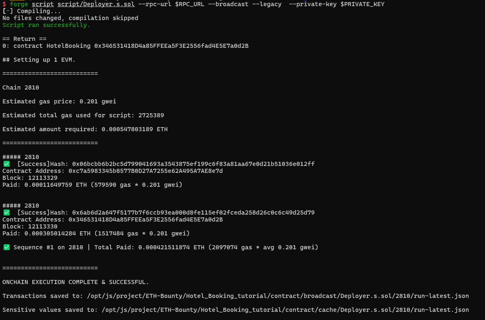
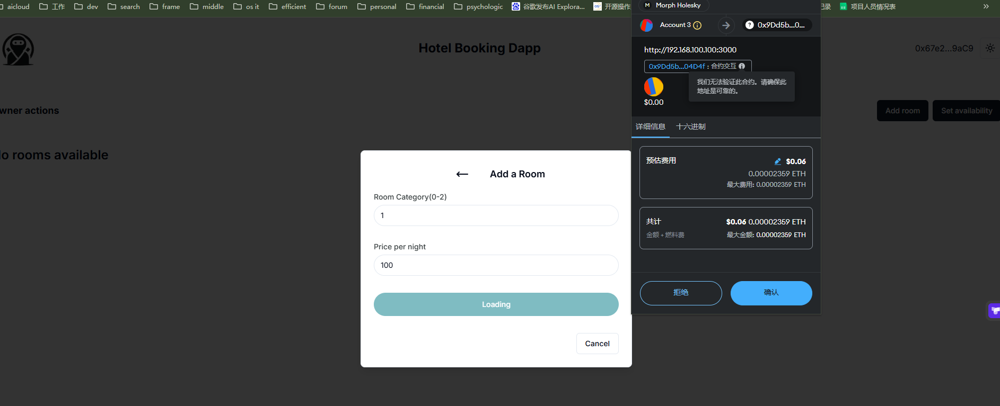

# ETH-Bounty

### Morph：

根据提供的指南开发一个基于Morph的去中心化酒店预定app

https://morph.ghost.io/developer-guide-building-a-decentralized-hotel-booking-system-on-morph-2/

### DoDo 公开拍卖

每个购买者在拍卖期间发送他们的竞标到智能合约。 竞标包括发送资金，以便将购买者与他们的竞标绑定。 如果最高出价被提高，之前的出价者就可以拿回他们的竞标资金。 竞价期结束后，出售人可以手动调用合约，收到他们的收益。

**公开拍卖**

1.每个购买者在拍卖期间发送他们的竞标到智能合约。

2.竞标包括发送资金，以便将购买者与他们的竞标绑定。

3.如果最高出价被提高，之前的出价者就可以拿回他们的竞标资金。

4.竞价期结束后，出售人可以手动调用合约，收到他们的收益。

- 5 时间加权出价奖励机制(在拍卖即将结束时，出价者的出价会根据距离拍卖结束

的时间权重进行调整。例如，在拍卖最后5分钟内的出价可以按某个倍数进行加

权，使得临近结束的出价会更有竞争力。)

- 6 竞拍冷却机制(为防止竞拍者连续快速出价，可以设置一个竞拍冷却期。每个出

价者在一次出价后，需要等待一段时间后才能再次出价，让拍卖过程更具策略

性。)

- 7 拍卖终局延长(如果在拍卖快要结束的最后几分钟内有人出价，则拍卖时间会自

动延长一定的时间（例如5分钟），避免“最后一秒出价”的情况，并让竞拍更

加激烈。

除了1，2，3，4基础拍卖功能外，还需要从5，6，7三个附加功能中选择任意一个实现。

### Arbitrum：（二选一）

1）编写一个基于retryable ticket系统的layer1-》layer2跨链消息系统，需要用户对l1合约进行操作，并且通过调用retryable来改写layer2上合约的状态。

(例子：合约A和合约B分别位于l1和l2，每次对合约A状态的更改都需要更改对应合约b的状态。)

2）用stylus （rust或者c/c++语言）重新改写uniswap v1或v2 (或者其他你想要改写的合约)
